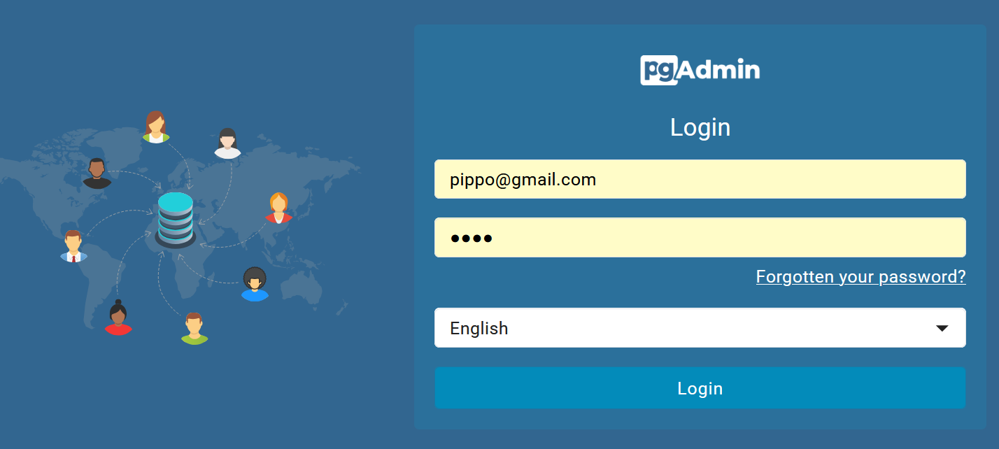
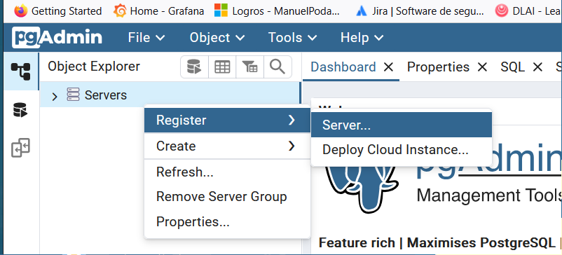
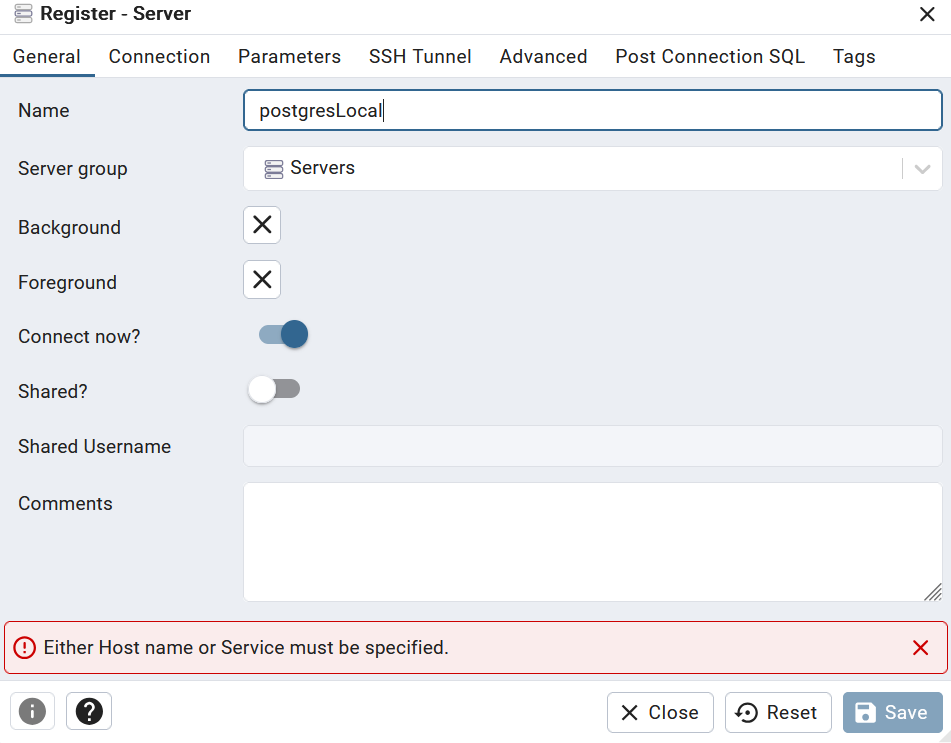
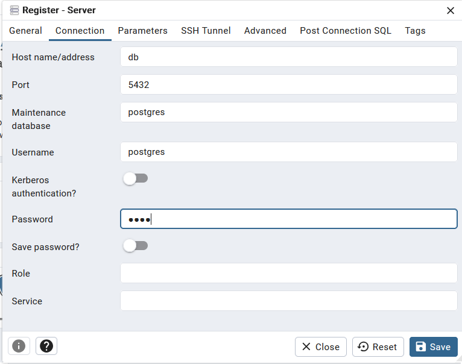
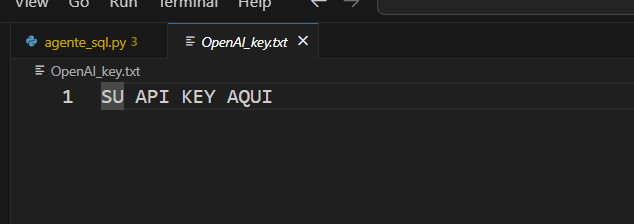
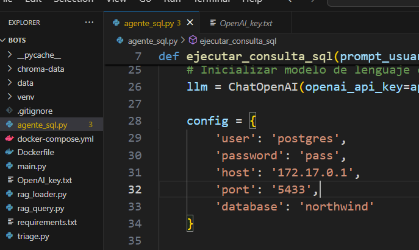

# DOCKER y DOCKER COMPOSE EN SU MÁQUINA

## Guía de Instalación: Docker Desktop y Rancher

Este documento proporciona los enlaces y referencias oficiales para instalar Docker Desktop y Rancher, dos herramientas fundamentales para entornos de desarrollo y gestión de contenedores.

---

## 🐳 Docker Desktop

Docker Desktop es una aplicación fácil de instalar que permite construir, compartir y ejecutar contenedores directamente desde tu máquina local.

### 🔗 Enlace de descarga

- Sitio oficial: [https://www.docker.com/products/docker-desktop/](https://www.docker.com/products/docker-desktop/)

### 📦 Requisitos del sistema

Docker Desktop está disponible para:

- **Windows** 10/11 (64-bit) con WSL 2
- **macOS** (Intel o Apple Silicon)
- **Linux** (versiones recientes de distribuciones principales)

Consulta los requisitos detallados aquí:  
👉 [https://docs.docker.com/desktop/install/](https://docs.docker.com/desktop/install/)

---

## 🐮 Rancher

Rancher es una plataforma de administración de clústeres Kubernetes que facilita el despliegue, la gestión y la operación de entornos Kubernetes.

### 🔗 Enlace de instalación

- Sitio oficial: [https://www.rancher.com/](https://www.rancher.com/)

### 📚 Guías de instalación

Rancher puede instalarse de varias formas, incluyendo:

- **Instalación en Docker (modo single node)**  
  👉 [https://ranchermanager.docs.rancher.com/pages-for-subheaders/install-rancher/docker-single-node-install](https://ranchermanager.docs.rancher.com/pages-for-subheaders/install-rancher/docker-single-node-install)

- **Instalación en Kubernetes (HA)**  
  👉 [https://ranchermanager.docs.rancher.com/pages-for-subheaders/install-rancher/helm-cli](https://ranchermanager.docs.rancher.com/pages-for-subheaders/install-rancher/helm-cli)

---

## ✅ Recomendaciones

- Considera usar **Rancher Desktop** si quieres una alternativa ligera a Docker Desktop con Kubernetes incluido:  
  👉 [https://rancherdesktop.io/](https://rancherdesktop.io/)

---

## 🔧 Recursos adicionales

- Docker Docs: [https://docs.docker.com/](https://docs.docker.com/)
- Rancher Docs: [https://ranchermanager.docs.rancher.com/](https://ranchermanager.docs.rancher.com/)
- Rancher GitHub: [https://github.com/rancher/rancher](https://github.com/rancher/rancher)


---
---

# USANDO EL ARCHIVO DOCKER-COMPOSE.YML


# 🐳 Explicación general del archivo `docker-compose.yml`

Este archivo define un entorno de contenedores con **Docker Compose** que incluye:

## Servicios definidos

### 1. 📦 `db` (PostgreSQL)

- Imagen utilizada: `postgres:12.2`
- Reinicio automático: `always`
- Variables de entorno:
  - `POSTGRES_DB`: nombre de la base de datos (`postgres`)
  - `POSTGRES_USER`: usuario por defecto (`postgres`)
  - `POSTGRES_PASSWORD`: contraseña del usuario (`pass`)
  - `PGDATA`: ruta de almacenamiento de los datos
- Volumen persistente: `db-data1` (para mantener los datos incluso si se reinicia el contenedor)
- Puerto expuesto: `5433` en la máquina local mapea al `5432` del contenedor (puerto por defecto de PostgreSQL)

### 2. 🖥️ `pgadmin` (Interfaz gráfica para PostgreSQL)

- Imagen utilizada: `dpage/pgadmin4:latest`
- Reinicio automático: `always`
- Variables de entorno:
  - `PGADMIN_DEFAULT_EMAIL`: correo de acceso a pgAdmin
  - `PGADMIN_DEFAULT_PASSWORD`: contraseña de acceso
  - `PGADMIN_LISTEN_PORT`: puerto en el contenedor (80)
- Volumen persistente: `pgadmin-data1`
- Puerto expuesto: `8081` en la máquina local mapea al `80` del contenedor (interfaz web)

## 📂 Volúmenes

- `db-data1`: almacena los datos de PostgreSQL
- `pgadmin-data1`: guarda la configuración y datos de pgAdmin

---

## 📄 Contenido del archivo `docker-compose.yml`

```yaml
services:
  db:
    image: postgres:12.2
    restart: always
    environment:
      POSTGRES_DB: postgres
      POSTGRES_USER: postgres
      POSTGRES_PASSWORD: pass
      PGDATA: /var/lib/postgresql/data
    volumes:
      - db-data1:/var/lib/postgresql/data
    ports:
      - "5433:5432"

  pgadmin:
    image: dpage/pgadmin4:latest
    restart: always
    environment:
      PGADMIN_DEFAULT_EMAIL: pippo@gmail.com
      PGADMIN_DEFAULT_PASSWORD: 1234
      PGADMIN_LISTEN_PORT: 80
    ports:
      - "8081:80"
    volumes:
      - pgadmin-data1:/var/lib/pgadmin

volumes:
  db-data1:
  pgadmin-data1:
```

---

## ▶️ Cómo construir y levantar los contenedores


1. Abre una terminal y navega al directorio:

```bash
cd ruta/al/directorio
```

2. Ejecuta el siguiente comando para levantar los contenedores:

```bash
docker-compose up -d
```

Esto hará lo siguiente:

- Descargará las imágenes si no están presentes
- Creará los contenedores
- Los iniciará en segundo plano (`-d` = detached)

---

## ✅ Verificación

- Accede a **pgAdmin** desde tu navegador:  
  [http://localhost:8081](http://localhost:8081)

- Accede a **PGADMIN4** con los siguientes datos desde cualquier cliente:

  - Usuario: `pippo@gmail.com`
  - Contraseña: `1234`




- Registre un nuevo servidor



- Nombre el servidor como más le guste, por ejemplo "postgresLocal"



- Accede a **PostgreSQL** con PGADMIN4 (creado con el mismo compose):
  
  - Host: `db`
  - Puerto: `5432`
  - Usuario: `postgres`
  - Contraseña: `pass`





- Accede a **PostgreSQL** con el código en python desde un proceso en otro contendor, en la misma máquina:

  config = {
        'user': 'postgres',
        'password': 'pass',
        'host': '172.17.0.1:5433',
        'database': 'northwind'
    }


---


## 🛑 Para detener los contenedores

```bash
docker-compose down
```

Esto detiene y elimina los contenedores, pero **mantiene los volúmenes** a menos que añadas `-v`.

---
---

## CREA UNA BASE DE DATOS Y EJECUTA EL SQL DEL ARCHIVO northwind.sql para crear y poblar tus tablas.

## 📌 Pasos en pgAdmin

### 1. Crear una nueva base de datos

1. Abre **pgAdmin** y conéctate a tu servidor PostgreSQL.
2. En el panel izquierdo, expande el árbol del servidor hasta ver el nodo `Databases`.
3. Haz clic derecho en `Databases` y selecciona **Create > Database...**
4. En el campo **Database**, escribe el nombre:

```
northwind
```

5. Haz clic en **Save** para crear la base de datos.

---

### 2. Abrir el editor de SQL (Query Tool)

1. En el árbol de navegación, haz clic derecho sobre la base de datos `northwind`.
2. Selecciona **Query Tool** para abrir el editor SQL.

---

### 3. Cargar el contenido del archivo SQL

1. Abre el archivo `northwind.sql` en un editor de texto o directamente desde el menú `File > Open` en el Query Tool.
2. Copia todo su contenido si lo abriste externamente.
3. Pega el contenido completo en el editor SQL de pgAdmin.

---

### 4. Ejecutar el script SQL

1. Haz clic en el botón de **ejecutar** (ícono de rayo o tecla de acceso rápido `F5`).
2. Espera a que se ejecute el script completamente. pgAdmin mostrará los mensajes de éxito o error en la consola de salida.

---

✅ ¡Listo! La base de datos `northwind` está creada y cargada con sus tablas y datos.


## ARRANCAR el contenedor con el BOT


# 🤖 Instrucciones para levantar el contenedor del BOT

Esta guía explica cómo levantar el contenedor del BOT usando `docker-compose`, configurar la API Key de OpenAI y cómo cambiar la base de datos si lo necesitas.

---

## 📁 1. Cambiarse al directorio del proyecto

Abre una terminal y navega hasta el directorio donde se encuentra el archivo `docker-compose.yml` del BOT:

```bash
cd ruta/al/directorio/del/bot
```

---

## 🔑 2. Añadir la API Key de OpenAI

Antes de levantar el contenedor, asegúrate de definir tu API Key de OpenAI como una variable de entorno.

### Opción A: Desde la terminal (solo para esta sesión)

```bash
export OPENAI_API_KEY=tu_clave_api_aqui
```

### Opción B: En un archivo `.env`

Crea un archivo llamado `.env` en el mismo directorio y añade:

```
OPENAI_API_KEY=tu_clave_api_aqui
```



---

## 🚀 3. Levantar el contenedor

Ejecuta el siguiente comando para construir y levantar el contenedor en segundo plano:

```bash
docker-compose up -d
```

Esto iniciará el bot y lo dejará corriendo en segundo plano.

---

## 🛠 4. Cambiar la base de datos

Si necesitas cambiar la base de datos a la que se conecta el bot, abre el archivo:

```
agente_sql.py
```

Y edita la sección donde se construye la cadena de conexión (`connection_string`) con los nuevos valores de host, puerto, usuario, contraseña y nombre de la base de datos.





---


✅ Con estos pasos, tu bot debería estar funcionando correctamente.

# LISTO !!
